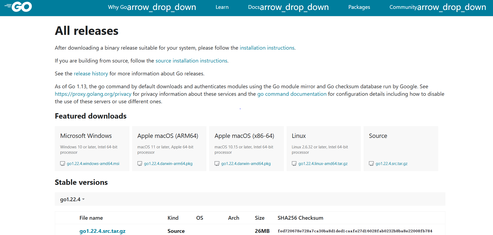
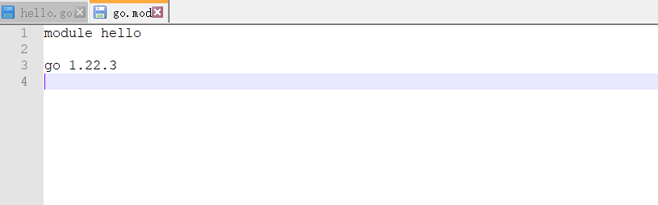
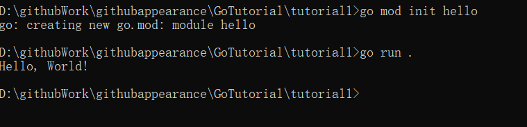
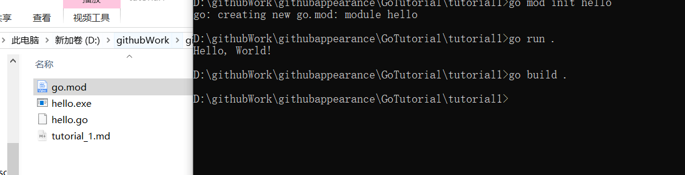

# Go的安装

Go官网：[All releases - The Go Programming Language (google.cn)](https://golang.google.cn/dl/)



下载对应的版本，比如说Windows，就直接下载那个msi安装程序包就行了

# Hello World的简单逻辑

代码：

```go
package main

import "fmt"

func main() {
	fmt.Println("Hello, World")
}
```

这个package  main  它告诉 Go 编译器这个文件包含可执行程序的入口点。Go 程序的执行总是从 `main` 包开始，而 `main` 函数是程序的入口点。因此，当你声明 `package main` 并且包含一个 `main` 函数时，Go 编译器会识别这个文件作为程序的启动文件。

打开cmd，执行以下命令

```
go mod init hello
```

Go 语言的模块初始化命令，用于创建一个新的 Go 模块并初始化其 `go.mod` 文件。这个命令是 Go 模块系统的一部分，它允许你管理项目的依赖项。



一般什么没有就模块和go的版本号

运行该程序，执行以下命令 

```
go run .
```



想编译成可执行文件，执行以下命令

```
go build .
```


